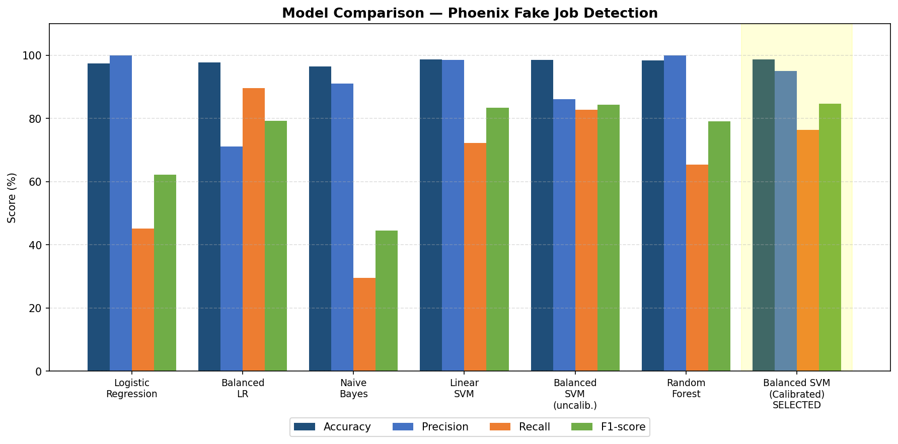

<p align="center">
  
</p>

# Phoenix – AI Job Safety Assistant

Phoenix is an AI-powered web application that helps job seekers identify potentially fraudulent job postings before applying.

Instead of only predicting whether a job is legitimate or fraudulent, Phoenix provides:

* 🤖 Machine Learning prediction
* ⚠ Rule-based risk assessment
* 🧠 AI-generated explanation using Google Gemini
* ✅ Practical safety recommendations

---

# 🌐 Live Demo

**Live Website**

https://phoenix-ai-job-detector.onrender.com

> **Note**
>
> This project is hosted on Render's free tier.
>
> The first request after inactivity may take **30–60 seconds** while the server wakes up.

---

# 📌 Problem Statement

Online job portals contain thousands of fake job postings designed to steal personal information or money from job seekers.

Many applicants struggle to identify suspicious listings before applying.

Phoenix assists users by analyzing job descriptions using Machine Learning, rule-based scam detection, and Generative AI explanations to improve decision-making.

---

# 🎯 Project Objective

* Detect fraudulent job postings
* Identify scam indicators inside job descriptions
* Explain predictions in natural language
* Help users make safer job application decisions

---

# 🚀 Features

* Machine Learning based fraud detection
* TF-IDF + Balanced Linear SVM (Calibrated) classifier
* Rule-based risk assessment
* Google Gemini AI explanation
* Safety recommendations
* Input validation
* Dark / Light mode
* Responsive UI

---

# 🛠 Tech Stack

## Frontend

* HTML5
* CSS3
* JavaScript

## Backend

* Flask

## Machine Learning

* Scikit-learn
* TF-IDF Vectorizer
* Balanced Linear SVM (Calibrated with CalibratedClassifierCV)
* Joblib
* Pandas
* NumPy

## AI

* Google Gemini API

---

# 📊 Dataset

**Dataset**

Fake Job Postings Dataset (Kaggle)

Approximately

* 17,880 samples
* Binary classification

Target

* 0 → Legitimate
* 1 → Fraudulent

---

# 📁 Folder Structure

```text
Phoenix/
│
├── app.py
├── requirements.txt
├── Procfile
├── .env.example
├── .gitignore
├── README.md
│
├── dataset/
│
├── trained_models/
│   ├── fake_job_detector.pkl
│   └── tfidf_vectorizer.pkl
│
├── templates/
│   └── index.html
│
├── static/
│   ├── css/
│   ├── js/
│   ├── icons/
│   └── images/
│
├── utils/
│   ├── gemini_explainer.py
│   ├── risk_assessment.py
│   ├── text_preprocessing.py
│   └── validate_input.py
│
└── notebooks/
```

---

# ⚙ Installation Guide

Follow every step carefully.

---

## Step 1 — Clone the Repository

Open VS Code.

Open a terminal.

Run

```bash
git clone https://github.com/Akanksha-git134/Phoenix-AI-job-detector.git
```

Move inside the project.

```bash
cd Phoenix-AI-job-detector
```

---

## Step 2 — Open the Project

If using VS Code

```bash
code .
```

---

## Step 3 — Create Virtual Environment

Windows

```bash
python -m venv .venv
```

Mac/Linux

```bash
python3 -m venv .venv
```

---

## Step 4 — Activate Virtual Environment

Windows

```bash
.venv\Scripts\activate
```

Mac/Linux

```bash
source .venv/bin/activate
```

You should now see

```text
(.venv)
```

at the beginning of the terminal.

---

## Step 5 — Install Dependencies

```bash
pip install -r requirements.txt
```

---

## Step 6 — Set Up Environment Variables

Phoenix ships with a `.env.example` template so you don't have to write the file from scratch.

Copy it to a real `.env` file:

Windows

```bash
copy .env.example .env
```

Mac/Linux

```bash
cp .env.example .env
```

Then open `.env` and replace the placeholder with your own Gemini API key:

```env
GEMINI_API_KEY_1=YOUR_GEMINI_API_KEY
```

You can get a free key from **https://aistudio.google.com/app/apikey**.

Phoenix supports multiple API keys, and will automatically switch to the next one if a key reaches its quota:

```env
GEMINI_API_KEY_1=xxxxxxxx

GEMINI_API_KEY_2=xxxxxxxx

GEMINI_API_KEY_3=xxxxxxxx
```

Only `GEMINI_API_KEY_1` is required — the others are optional.

> **Important:** never commit your real `.env` file to GitHub. It's already listed in `.gitignore`, so `git status` should never show it as a tracked change. Only `.env.example` (with no real keys inside it) should be pushed.

---

## Step 7 — Run the Application

```bash
python app.py
```

Open

```text
http://127.0.0.1:5000
```

in your browser.

---

# ☁ Deployment

Phoenix is deployed using **Render**.

Production server

Gunicorn

Procfile

```text
web: gunicorn app:app
```

> **Note:** when deploying, `.env` is not uploaded (it's gitignored). Instead, add each `GEMINI_API_KEY_*` as an Environment Variable directly in your Render dashboard under Settings → Environment.

---

# 🧠 How Phoenix Works

1. User submits a job description.

2. Input validation checks

* Empty input
* Spam
* Repetition
* Minimum content

3. Text preprocessing

* HTML removal
* URL removal
* Email removal
* Number removal
* Lowercasing
* Contraction expansion

4. TF-IDF converts text into vectors.

5. Balanced Linear SVM (Calibrated) predicts

* Legitimate or Fraudulent, with a confidence score

6. Rule-based engine independently checks scam indicators like

* Registration fee
* Telegram
* WhatsApp
* No interview
* Immediate joining
* High salary
* Urgent hiring

and assigns a risk level (Low / Medium / High).

7. The ML prediction and the rule-based risk level are combined to produce the final three-way classification: **Legitimate**, **Suspicious**, or **Fraudulent**.

8. Gemini AI generates a natural-language explanation based on the prediction and risk reasons.

9. Phoenix displays

* Prediction
* Confidence
* Risk Level
* AI Explanation
* Safety Tips

---

# 📈 Model Performance

Seven models were trained and compared using TF-IDF features. Precision, Recall, and F1-score were prioritized over raw accuracy, since the dataset is highly imbalanced (~95% legitimate / ~5% fraudulent).

| Model | Accuracy | Precision | Recall | F1-score |
|---|---|---|---|---|
| Logistic Regression | 97.34% | 100.00% | 45.09% | 62.15% |
| Balanced Logistic Regression | 97.73% | 71.10% | 89.60% | 79.28% |
| Multinomial Naive Bayes | 96.45% | 91.07% | 29.48% | 44.54% |
| Linear SVM | 98.60% | 98.43% | 72.25% | 83.33% |
| Balanced Linear SVM (uncalibrated) | 98.52% | 86.14% | 82.66% | 84.37% |
| Random Forest | 98.32% | 100.00% | 65.32% | 79.02% |
| **Balanced Linear SVM (Calibrated) — Selected** | **98.66%** | **94.96%** | **76.30%** | **84.62%** |



> Calibration (via `CalibratedClassifierCV`) was applied on top of the Balanced Linear SVM so the model can output reliable probability scores, since `LinearSVC` does not natively support `predict_proba`. These probabilities power the confidence score and risk-level bucketing shown to users.

---

# ⚠ Known Limitations

* English language only

* TF-IDF cannot understand deep semantic meaning.

* The model was trained on realistic job postings and may not behave reliably on meaningless or adversarial input.

* Rule-based assessment and ML prediction are independent and may occasionally disagree.

* Gemini explains the prediction but does not independently verify it.

* Recall is 76.30%, meaning roughly a quarter of actual fraudulent postings may currently go undetected by the ML model alone; the rule-based layer helps catch some of these independently.

---

# 🔮 Future Improvements

* Company verification

* Domain reputation analysis

* SHAP/LIME explainability

* Resume matching

* PDF upload

* Multi-language support

* Insufficient-information detection

---

# 🛑 Common Errors and Solutions

## 1. ModuleNotFoundError

Install dependencies again.

```bash
pip install -r requirements.txt
```

---

## 2. Gemini API Error

Check

* API key is valid
* API key is inside `.env`
* `.env` is in the project root
* You copied `.env.example` to `.env` (not just renamed it in a different folder)

---

## 3. Virtual Environment Not Activated

If you do not see

```text
(.venv)
```

activate it again.

Windows

```bash
.venv\Scripts\activate
```

---

## 4. Port Already in Use

Close the previous Flask instance.

Or stop it using

```text
Ctrl + C
```

Then run

```bash
python app.py
```

again.

---

## 5. Trained Model Not Found

Ensure these files exist

```text
trained_models/

fake_job_detector.pkl

tfidf_vectorizer.pkl
```

Without them the application cannot make predictions.

---

## 6. Google Gemini Explanation Not Appearing

The prediction will still work.

Only the AI explanation requires a valid Gemini API key.

---

## 7. Render Takes Time to Load

Render free instances sleep after inactivity.

The first request may take

30–60 seconds.

---

# 👩‍💻 Author

**Akanksha**

B.Tech

Computer Science Engineering in AI

Indira Gandhi Delhi Technical University for Women (IGDTUW)

---

⭐ If you found this project useful, consider giving the repository a star.